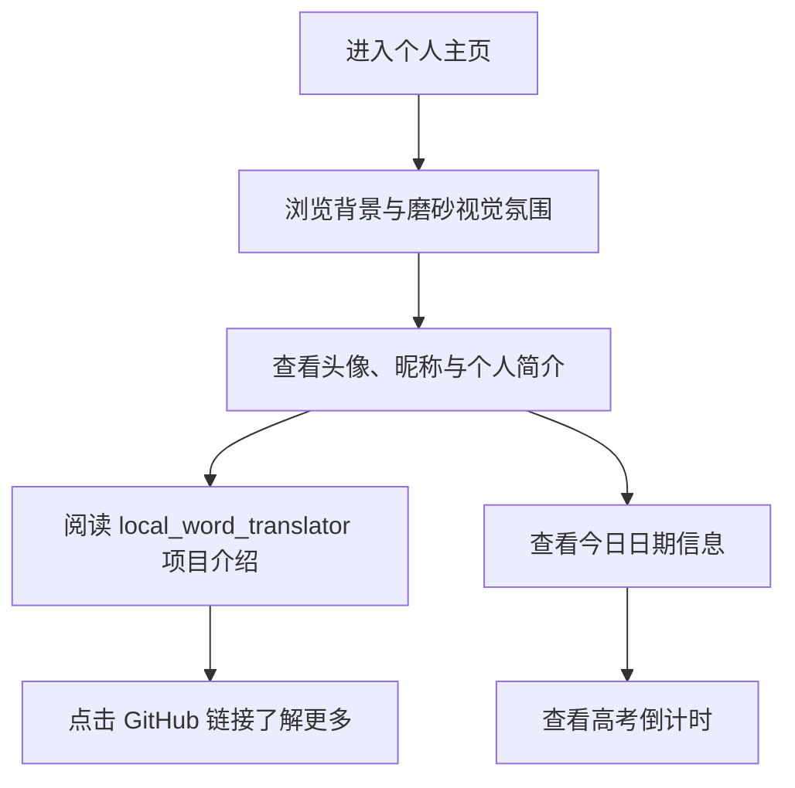

## 1. 产品概述
这是一个用于展示个人信息与代表项目的单页个人主页，核心目标是以玻璃拟态视觉呈现个人品牌、项目亮点与实用日期信息。
- 面向浏览者、潜在合作方与招聘方，快速了解 `joki` 的身份、GitHub 入口以及 `local_word_translator` 项目的价值。
- 页面兼顾展示感与实用性，通过“今日日期 + 高考倒计时”增强页面陪伴属性与信息密度。

## 2. 核心功能

### 2.1 功能模块
1. **主页**：背景图、磨砂雾面、个人资料卡片、每日一言、GitHub 跳转、项目展示、日期与倒计时信息。

### 2.2 页面详情
| 页面名称 | 模块名称 | 功能描述 |
|-----------|-------------|---------------------|
| 主页 | 背景氛围层 | 使用 `image/back.png` 作为全屏背景，并叠加半透明模糊遮罩，形成磨砂雾面氛围。 |
| 主页 | 个人资料卡片 | 展示头像 `image/head.png`、昵称 `joki`、一句简短身份说明与个人简介内容。 |
| 主页 | 每日一言卡片 | 位于左侧个人资料卡片上方，每次刷新从 19 条名言库中随机选取一条展示，来源涵盖《凉宫春日系列》《边狱巴士》《AIR》《无职转生》《吹响吧！上低音号》。 |
| 主页 | GitHub 入口 | 提供跳转至 `https://github.com/joki233` 的明显按钮或链接。 |
| 主页 | 项目展示卡片 | 重点介绍 `local_word_translator`，突出“自动划词翻译”“基于 Ollama 本地大模型”“Win11 风格 UI”“无需快捷键”“无需联网”等卖点，并提供项目仓库链接 `https://github.com/joki233/local_word_translator`。 |
| 主页 | 日期卡片 | 显示今天的公历日期、星期信息与视觉化日历区域。 |
| 主页 | 倒计时卡片 | 以 `2027-06-07` 为目标日期，动态展示距离高考的剩余天数。 |

## 3. 核心流程
用户打开页面后，首先感知到背景与玻璃卡片风格；随后视线聚焦在头像与昵称区域，快速理解站点归属；接着浏览项目介绍与 GitHub 入口；最后查看今日日期与高考倒计时。

## 4. 用户界面设计
### 4.1 设计风格
- 主色调：冷灰蓝、雾白、浅青色高光，营造清爽的 Win11 风格玻璃感，并加入雨滴落水式的同心圆波纹氛围。
- 按钮样式：圆角按钮，半透明描边，悬停时轻微发光与抬升；卡片悬停时同步应用类似的发光与抬升反馈。
- 字体建议：中文优先使用 `Microsoft YaHei UI`、`Segoe UI`、`PingFang SC` 的系统回退组合，突出简洁现代感。
- 布局风格：桌面优先的多卡片错落布局，个人相关卡片整体位于上方区域，项目与功能信息卡片整体位于下方区域，避免过于整齐的栅格感。
- 图标风格建议：简洁线性图标或少量 Unicode 符号，不使用复杂插画。

### 4.2 页面设计概览
| 页面名称 | 模块名称 | UI 元素 |
|-----------|-------------|-------------|
| 主页 | 背景氛围层 | 全屏背景图、暗色透明遮罩、模糊滤镜、轻微渐变层，并在点击背景空白处触发雨滴落水式同心圆波纹。 |
| 主页 | 个人资料卡片 | 圆角玻璃卡、头像、昵称标题、简介文本、柔和阴影、悬停抬升，并带小范围淡紫背光。 |
| 主页 | 每日一言卡片 | 圆角玻璃卡、引用语录、来源出处、悬停抬升，带淡紫背光，字体做轻微对比凸显。 |
| 主页 | GitHub 入口 | 高辨识度按钮、外链图标或文字提示、悬停动画。 |
| 主页 | 项目展示卡片 | 标题、副标题、卖点标签、简介段落、信息分组、项目仓库按钮，作为错落布局中的主项目展示卡片。 |
| 主页 | 日期卡片 | 年月日文本、星期展示、局部高亮的日历风格区块。 |
| 主页 | 倒计时卡片 | 大号数字、目标日期说明、辅助描述文案。 |

### 4.3 响应式设计
- 采用桌面优先设计，主要适配常见笔记本与桌面显示器。
- 在窄屏下自动切换为单列堆叠布局，确保卡片顺序清晰、文字可读。
- 兼顾触控场景，按钮与点击区域保持足够尺寸。
