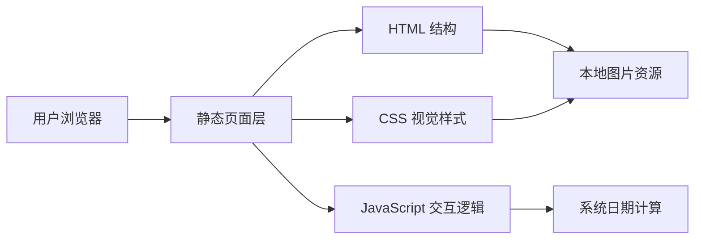

## 1. 架构设计


## 2. 技术说明
- 前端：原生 `HTML5 + CSS3 + JavaScript`
- 初始化方式：手工搭建静态页面文件结构
- 后端：无
- 数据存储：无，页面文案与目标日期采用前端静态配置
- 资源依赖：使用本地图片资源 `image/back.png` 与 `image/head.png`

之所以采用原生静态方案，是因为用户明确要求交付 `html` 格式个人网页，且页面功能集中、无复杂状态管理需求，使用原生方案更轻量、易于直接部署到静态托管环境。

## 3. 路由定义
| 路由 | 用途 |
|-------|---------|
| `/` | 个人主页，展示个人资料、每日一言、项目介绍、GitHub 链接、今日日期与高考倒计时。 |

## 4. 模块定义
| 模块 | 职责 |
|------|------|
| 页面骨架模块 | 定义主页主结构与各卡片区域语义标签，并预留后续新增项目的下方扩展区。 |
| 背景视觉模块 | 负责背景图铺满、遮罩、模糊与点击触发式雨滴水波纹样式。 |
| 个人资料模块 | 展示头像、昵称、身份描述与个人简介。 |
| 每日一言模块 | 从 19 条名言数组中随机选取一条渲染，来源涵盖《凉宫春日系列》《边狱巴士》《AIR》《无职转生》《吹响吧！上低音号》，每次刷新随机切换。 |
| 项目展示模块 | 呈现 `local_word_translator` 项目定位、功能亮点、价值说明与仓库链接，并作为错落布局中的主项目展示区。 |
| 外链跳转模块 | 提供 GitHub 按钮，并支持新标签页打开。 |
| 日期展示模块 | 读取当前系统日期并格式化展示。 |
| 倒计时模块 | 根据 `2027-06-07` 计算剩余天数并动态渲染。 |
| 水波背景模块 | 监听背景空白处点击，在点击坐标生成同心圆扩散波纹。 |

## 5. 数据定义
### 5.1 前端配置对象
```ts
type ProfileConfig = {
  nickname: string;
  intro: string;
  githubUrl: string;
  projectName: string;
  projectSubtitle: string;
  gaokaoDate: string;
};
```

### 5.2 运行时计算数据
```ts
type CalendarState = {
  todayText: string;
  weekdayText: string;
  remainingDays: number;
};
```

## 6. 实现要点
- 采用单页静态结构，文件建议拆分为 `index.html`、`style.css`、`script.js`。
- 使用 `backdrop-filter`、半透明背景、柔和描边与阴影构建磨砂玻璃效果。
- 使用 CSS Grid 结合位移与旋转微调实现桌面端错落卡片布局，并在移动端切换为单列布局。
- 使用原生 JavaScript 在页面加载时计算今天日期与高考倒计时。
- 倒计时展示需处理目标日期已过或当天到达的边界情况，避免出现负数展示。
- 外链按钮增加 `target="_blank"` 与 `rel="noreferrer"`，提升可用性与安全性。
- 卡片悬停时复用按钮的抬升、光感与阴影反馈，保证交互风格统一。
- 背景水波纹由 JavaScript 在点击背景时动态创建节点，并由 CSS 控制扩散动画与自动销毁时机。
- 非项目类卡片在卡片背后叠加小范围淡紫色光晕，强化与项目卡片的视觉区分。
